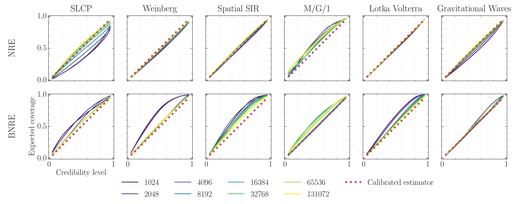

# Towards Reliable Simulation-Based Inference with Balanced Neural Ratio Estimation

## Abstract
Modern approaches for simulation-based inference rely upon deep learning surrogates to enable approximate inference with computer simulators. In practice, the estimated posteriors’ computational faithfulness is, however, rarely guaranteed. For example, Hermans et al. [1] show that current simulation-based inference algorithms can produce posteriors that are overconfident, hence risking false inferences. In this work, we introduce Balanced Neural Ratio Estimation (BNRE), a variation of the NRE algorithm [2] designed to produce posterior approximations that tend to be more conservative, hence improving their reliability, while sharing the same Bayes optimal solution. We achieve this by enforcing a balancing condition that increases the quantified uncertainty in small simulation budget regimes while still converging to the exact posterior as the budget increases. We provide theoretical arguments showing that BNRE tends to produce posterior surrogates that are more conservative than NRE’s. We evaluate BNRE on a wide variety of tasks and show that it produces conservative posterior surrogates on all tested benchmarks and simulation budgets. Finally, we emphasize that BNRE is straightforward to implement over NRE and does not introduce any computational overhead.

[1] Joeri Hermans, Arnaud Delaunoy, François Rozet, Antoine Wehenkel, and Gilles Louppe.
Averting A Crisis In Simulation-Based Inference. arXiv e-prints, art. arXiv:2110.06581, October
2021.

[2] Joeri Hermans, Volodimir Begy, and Gilles Louppe. Likelihood-free MCMC with amortized
approximate ratio estimators. In Hal Daumé III and Aarti Singh, editors, Proceedings of the
37th International Conference on Machine Learning, volume 119 of Proceedings of Machine
Learning Research, pages 4239–4248. PMLR, 13–18 Jul 2020.



## Demo

See [demo.ipynb](demo.ipynb) for a demo of BNRE. Before executing the notebook, please install the latest version of lampe by running the following command.
```
pip install git+https://github.com/francois-rozet/lampe
```
## Reproducing the experiments
First install all the dependencies from the [requirements.txt](requirements.txt) file. The pipelines performing all the experiments can then be executing by running the following commands
```
bash scripts/run-bnre.sh
bash scripts/run-nre.sh
```
If executed on a slurm cluster, those pipelines will dispatch the experiments into different jobs. The results can then be visualized in the [workflows/bnre/results.ipynb](workflows/bnre/results.ipynb) notebook.

## Citation

See [CITATION.cff](CITATION.cff)

## License

Described the `LICENSE` file.
